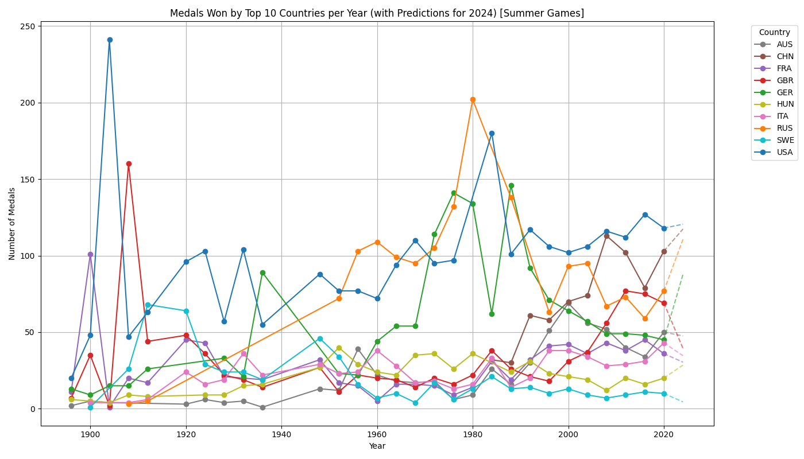

# Data Bolts - Codedex Hackathon 2024

For graphing Olympic data and predicting the performance of countries.

## Description

Data Bolt is a comprehensive tool designed to visualize Olympic data and predict future performance trends of various countries. By utilizing historical data and machine learning models, it generates insightful graphs and predictions, helping analysts and enthusiasts to understand and forecast Olympic outcomes.

Website: https://faisalmujawar148.github.io/
Demo of the Website: https://www.youtube.com/watch?v=FVRKd1MsQ9M




## Getting Started

### Dependencies

* Python 3.6 or higher
* pandas
* numpy
* seaborn
* matplotlib
* scikit-learn

To install the necessary Python libraries, you can use the following command:
```sh
pip install pandas numpy seaborn matplotlib scikit-learn
```

### Installing

1. Clone the repository:
    ```sh
    git clone https://github.com/yourusername/databolt.git
    ```
2. Navigate to the project directory:
    ```sh
    cd databolt
    ```
3. Ensure the data files are in the correct directory structure as expected by the scripts.

### Executing program

1. Ensure the data files are in the following paths:
    - `Data/Olympics/olympic_hosts.csv`
    - `Data/Olympics/olympic_medals.csv`
    - `Data/Olympics/olympic_results.csv`
    - `Data/Olympics/olympic_athletes.csv`
    - `Data/Olympics/Summer-Olympic-medals-1976-to-2008.csv`

2. Run the visualization script:
    ```sh
    python DataSetVisualier9000.py
    ```

3. Run the prediction script:
    ```sh
    python OlymPicsGenerator500.py
    ```
The first script (DataSetVisualiser9000) will generate a singular graph, which can be saved if wanted.
The second script (OlymPicsGenerator500) will generate plots based on the provided data and save them to an output folder directory.

## Help

For common issues or further assistance, you can use the following command:
```sh
python -m pip help
```
Check if all required libraries are installed and the data paths are correct.

## Authors

Contributors names and contact info:
- Faisal Mujawar [Linkedin](https://www.linkedin.com/in/faisal-mujawar/)
- Mei Li Garcia O’Neil [Linkedin](https://www.linkedin.com/in/mei-li-oneil-a17b57229/)
- Anthony Padilla [Linkedin](https://www.linkedin.com/in/anthony-padilla-9401a0247/)

## Version History

* 0.2
    * Various bug fixes and optimizations
    * uploaded OlymPicsGenerator500 -> with every summer event figure
    * Uploaded the webpage
    * See [commit change]() or See [release history]()
* 0.1
    * Initial Release, only DataSetVisualiser9000, and overall figure

## License

This project is licensed under the MIT License - see the LICENSE.md file for details.

## Acknowledgments

Inspiration, code snippets, etc.:
* [awesome-readme](https://github.com/matiassingers/awesome-readme)
* [Olympic Data 1896-2022](https://www.kaggle.com/datasets/piterfm/olympic-games-medals-19862018)
* [Summer Olympics Medals (1976-2008)](https://www.kaggle.com/datasets/divyansh22/summer-olympics-medals)
* [Stefanie Molin](https://github.com/stefmolin)


